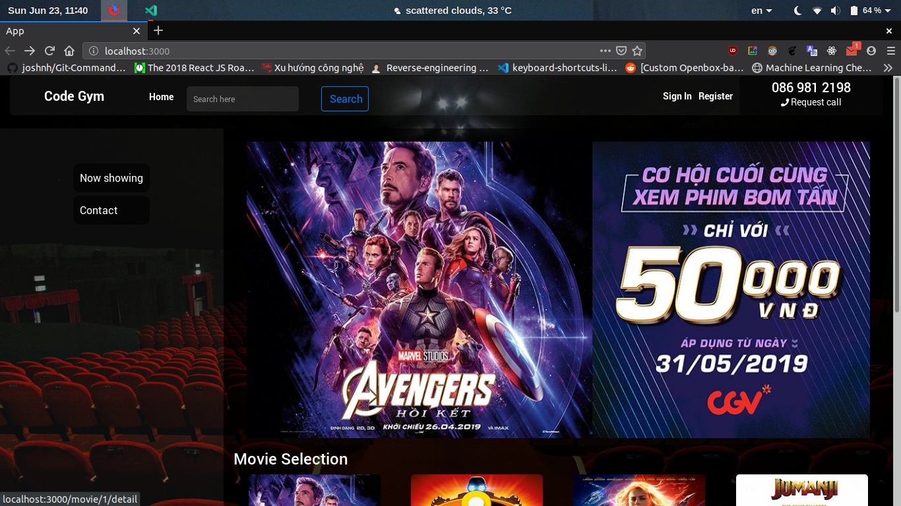

# Đồ Án Web 2
> Ứng dụng đặt vé xem phim.




## Cài đặt (môi trường dev)
### Required: 
Nodejs, psql

Server:

```sh
sudo docker-compose up

bash data.sh
```

Client:

```sh
npm run dev:client
```

Config file .env

```sh
DOMAIN=http://localhost:3000
```

## Công nghệ sử dụng

Language:
- Javascript

Server:
- Express framework
- Postgresql (Sequelize apis)

Client:
- Parcel

Other:
- Docker

## Thực hiện
- **Thanh Dinh**
- Vu Dao
- Viet Tran
- Vien Huynh

